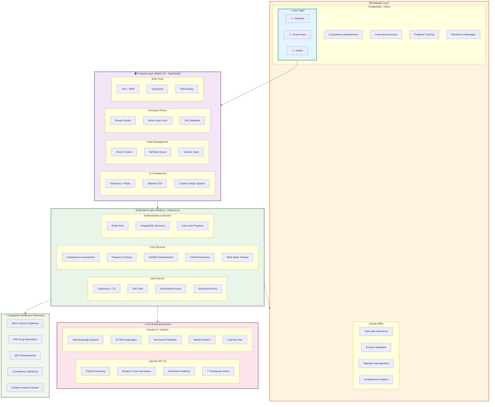
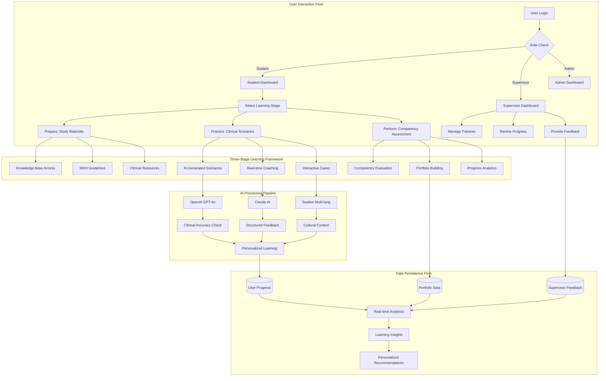
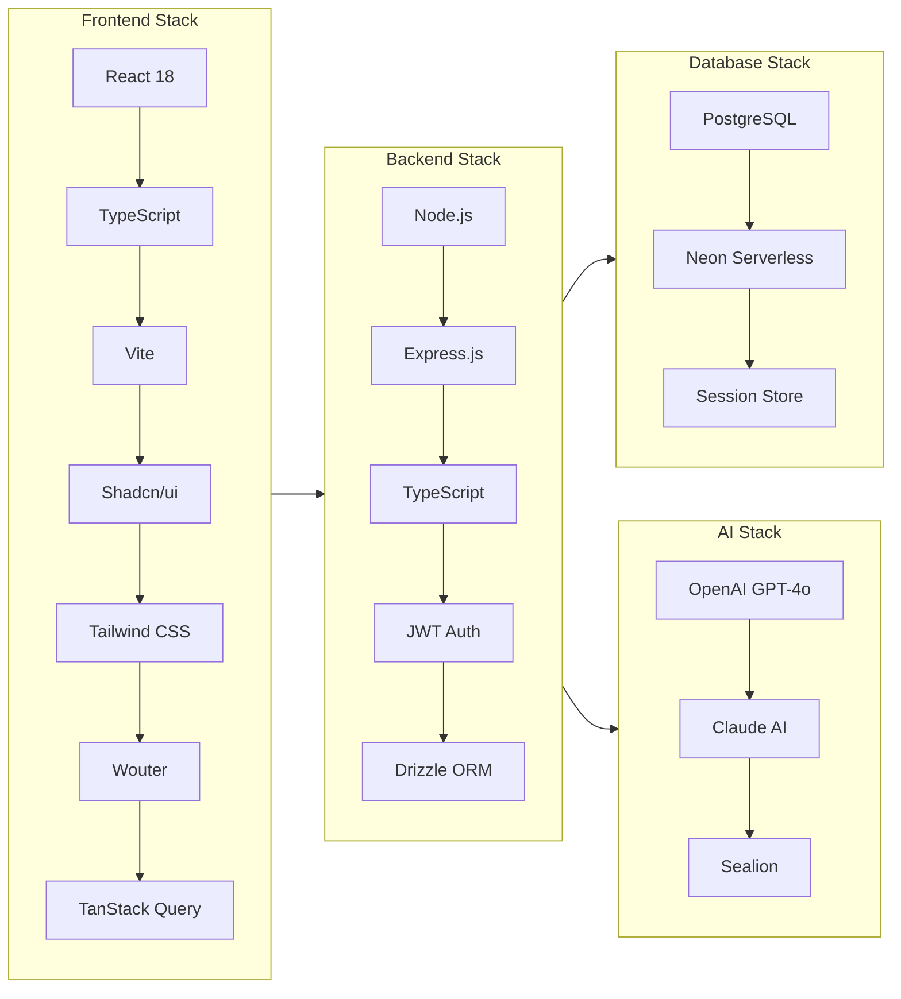
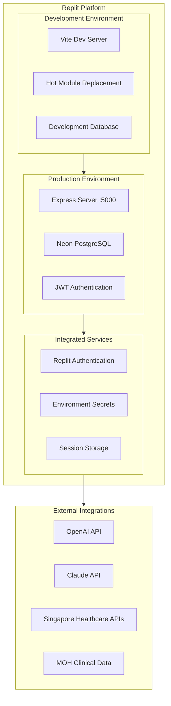
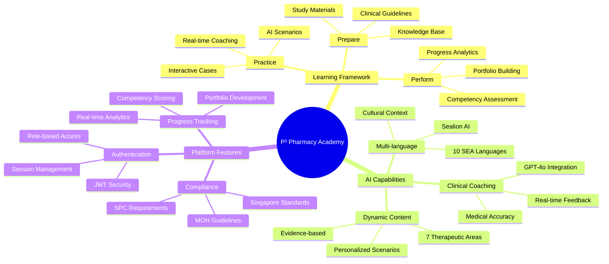

# P³ Pharmacy Academy - System Architecture (Mermaid)

## High-Level Architecture Overview

## Detailed Data Flow Architecture

## Technical Stack Overview

## Deployment & Infrastructure

## Key Features & Capabilities

## Usage Instructions

1. **For Presentations**: Copy any of the Mermaid code blocks above
2. **Online Rendering**: Paste into [Mermaid Live Editor](https://mermaid.live/)
3. **Documentation**: Include in Markdown files for automatic rendering
4. **Integration**: Most platforms (GitHub, GitLab, Notion) support Mermaid natively

Each diagram focuses on different aspects of your architecture:
- **Overview**: High-level system components and relationships
- **Data Flow**: How information moves through your system
- **Tech Stack**: Specific technologies and their connections
- **Deployment**: Infrastructure and hosting setup
- **Features**: Mind map of key capabilities

These diagrams are perfect for technical presentations, documentation, and stakeholder communications!